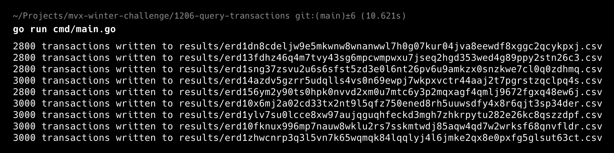

# Day 3 - Transaction Query

Query transactions of the accounts created in the first day on MultiversX testnet blockchain.

## Prerequisites

- Go 1.23 or later

## Installation

1. Clone the repository
   ```bash
   git clone https://github.com/emr/mvx-winter-challenge.git
   ```
2. Go to the project directory
   ```bash
   cd 1206-query-transactions/
   ```
3. Install dependencies:
   ```bash
   go mod download
   ```

## Usage

Run the script:

```bash
go run cmd/main.go
```

## Output

CSV files will be created for each account in `results` directory. The results of the accounts created in the first day are already present in it.


